# Connect to Autonomous AI Database with SQL Developer

## Introduction

Oracle Autonomous AI Database accepts secure database connections. In this lab, you will download an instance wallet and use it to connect the Oracle SQL Developer desktop client securely to your database.

Estimated Time: 15 minutes

### Objectives

In this lab, you will:

- Install or start Oracle SQL Developer.
- Download an instance wallet from Autonomous AI Database.
- Create and test a Cloud Wallet connection in SQL Developer.

### Prerequisites

- An available Oracle Autonomous AI Database instance.
- The database administrator username and password.
- Permission to download the database wallet.

## Task 1: Install or Start SQL Developer

1. Download the latest version of Oracle SQL Developer from the [SQL Developer download page](https://www.oracle.com/database/sqldeveloper/technologies/download/) for your platform. For Windows, select the download that includes the required JDK.

    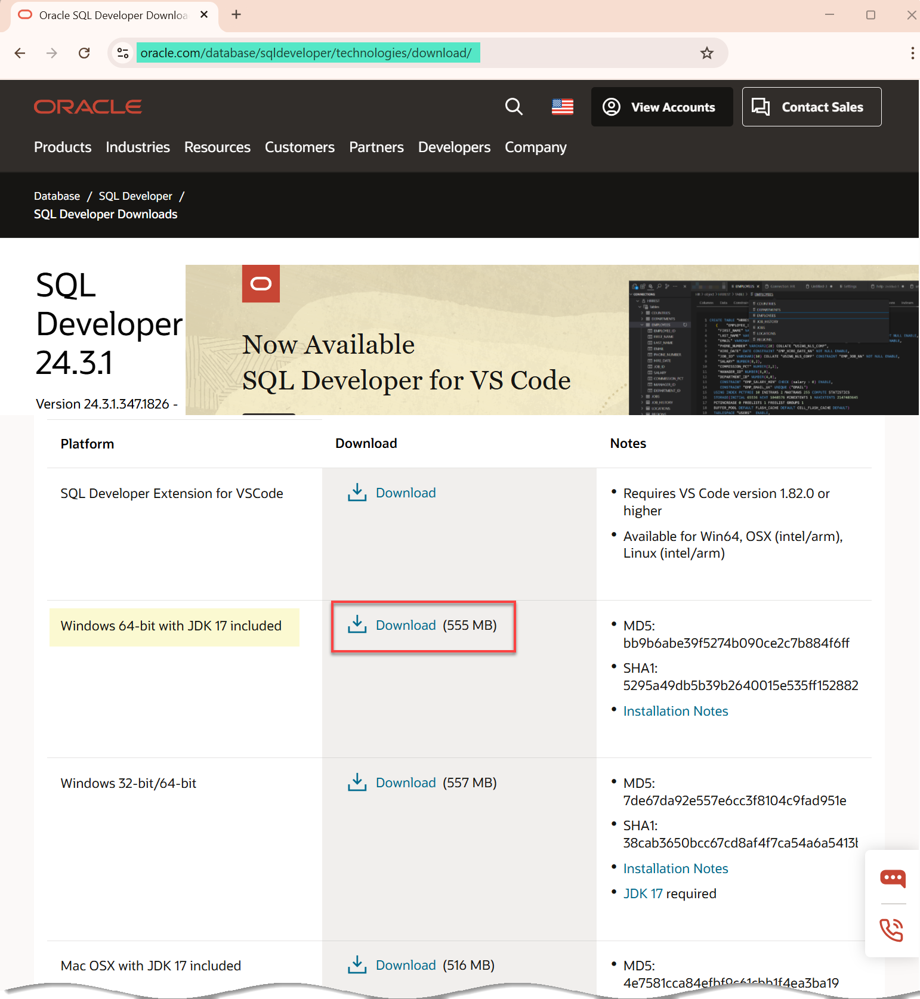

    > **Note:** If an Oracle License Agreement is displayed, review and accept the agreement before downloading.

2. After the ZIP file is downloaded, right-click the file, and then select **Extract All**.

    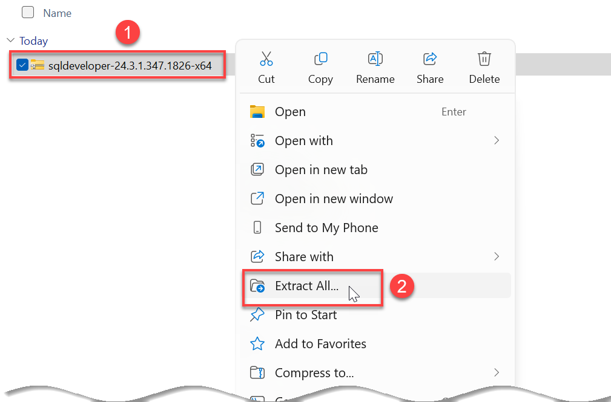

3. Select the destination folder, and then click **Extract**.

    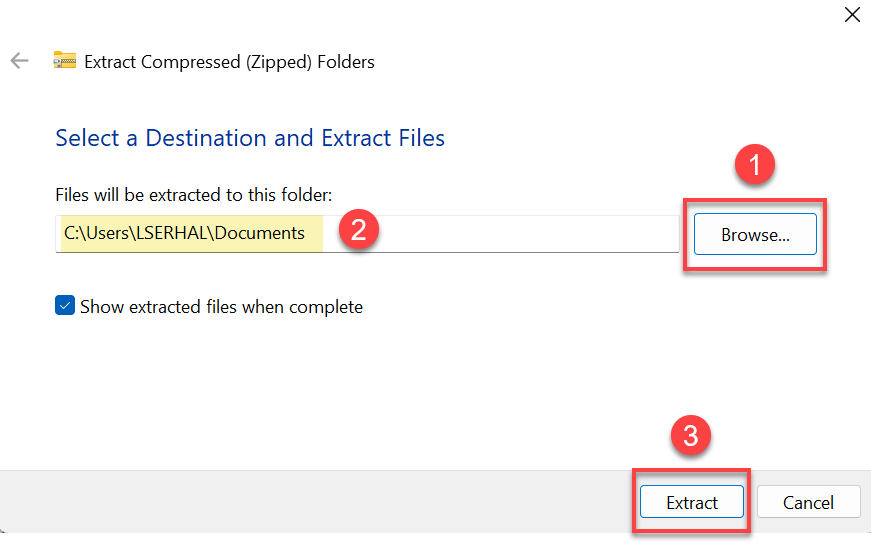

4. Open the extracted `sqldeveloper` folder, and then double-click **sqldeveloper.exe**.

    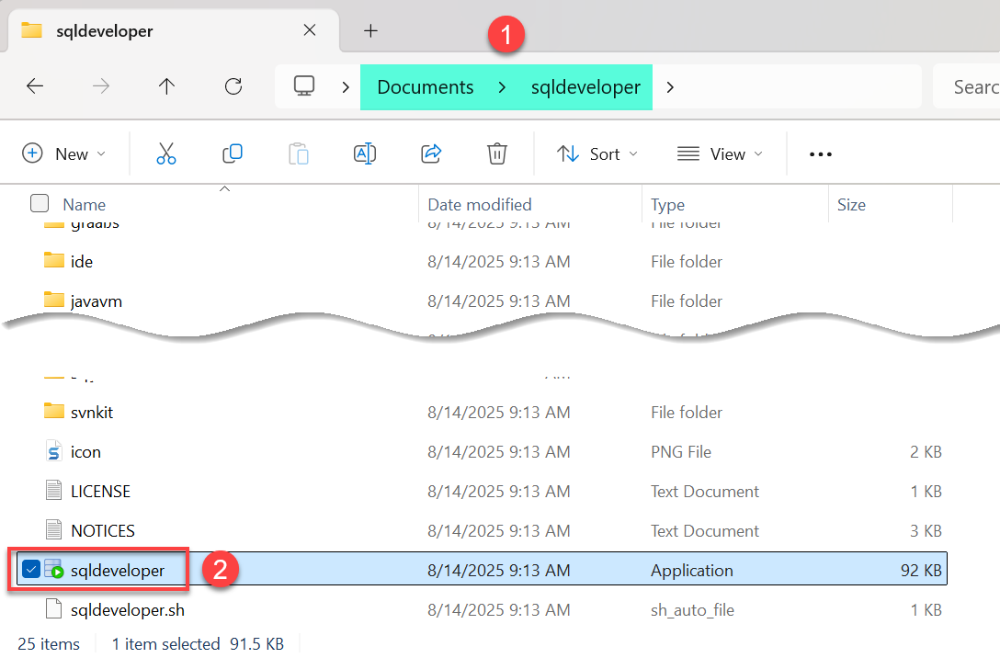

5. If SQL Developer asks whether you want to import preferences from a previous installation, select the appropriate option. For a new installation, click **No**.

    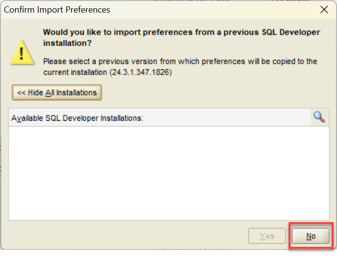

    SQL Developer starts. If the **Oracle Usage Tracking** dialog is displayed, review the settings, and then click **OK**.

    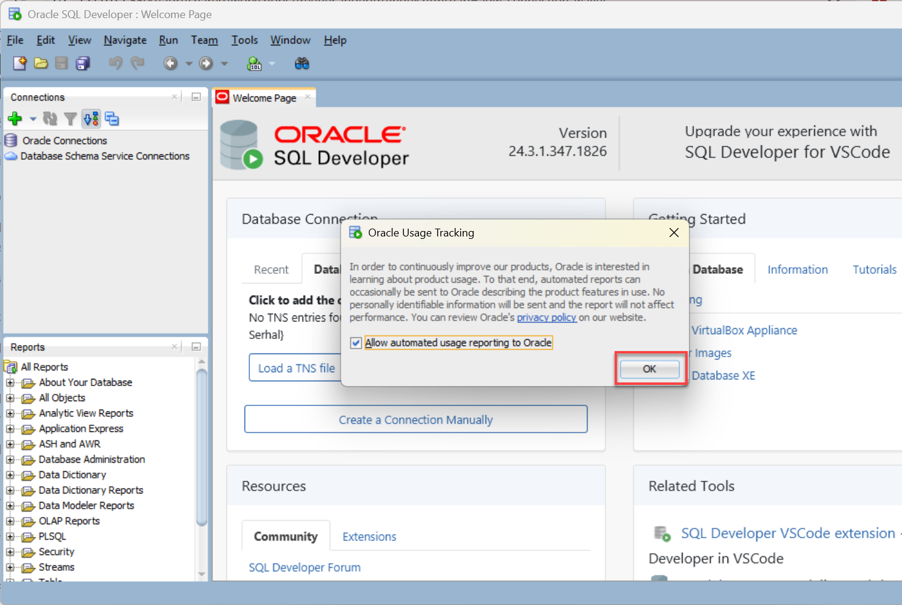

## Task 2: Download the Instance Wallet

1. In the OCI Console, open the details page for your Autonomous AI Database, and then click **Database connection**.

    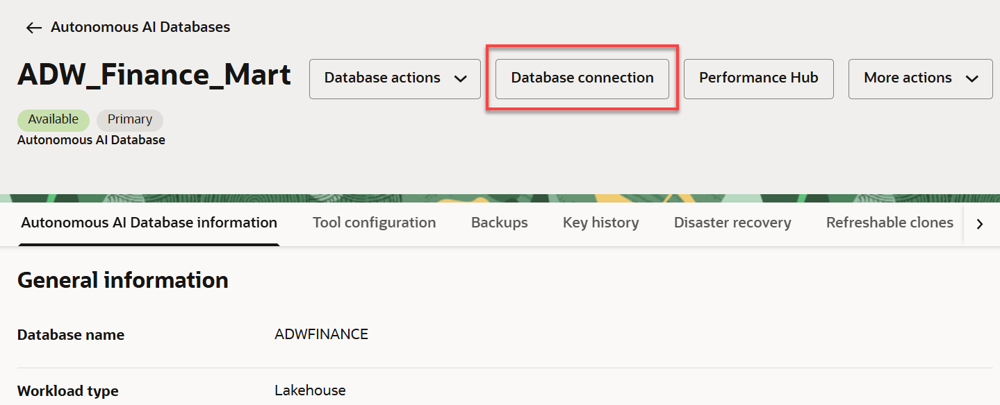

2. In the **Database connection** panel, locate **Download client credentials (Wallet)**. Keep **Instance wallet** selected, and then click **Download wallet**.

    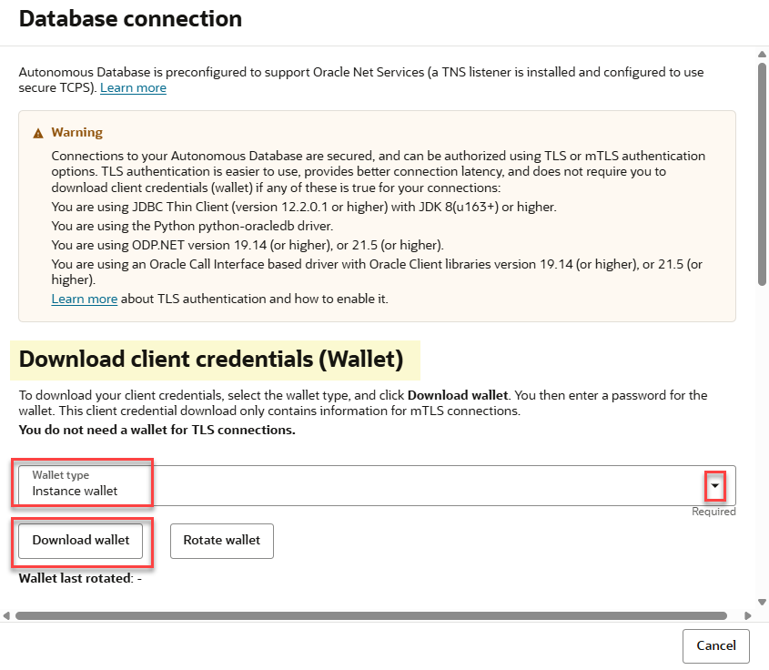

    > **Note:** Oracle recommends using an instance wallet for application and end-user access whenever possible. A regional wallet provides access information for multiple databases and is intended primarily for administrative use.

3. Enter and confirm a wallet password, and then click **Download**. Save the password because you may need it when configuring database clients.

    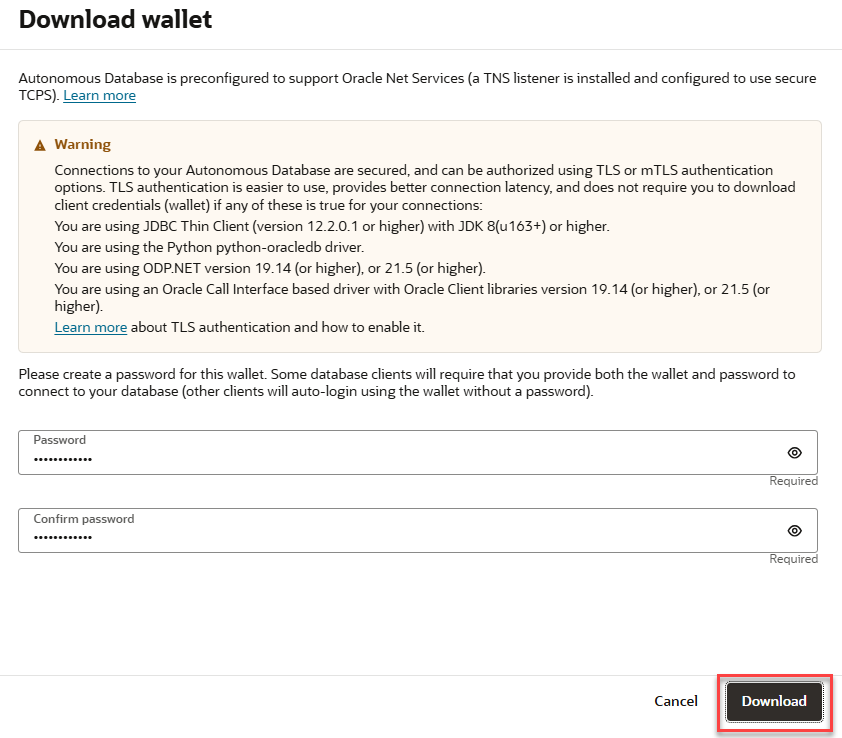

    > **Note:** If the download does not start, check whether your browser blocked the download or a pop-up from the Oracle Cloud domain.

4. Save the downloaded ZIP file in a secure location. Do not extract or modify the wallet unless your client specifically requires it.

    <if type="freetier">
    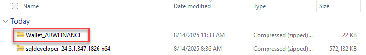
    </if>

    <if type="livelabs">
    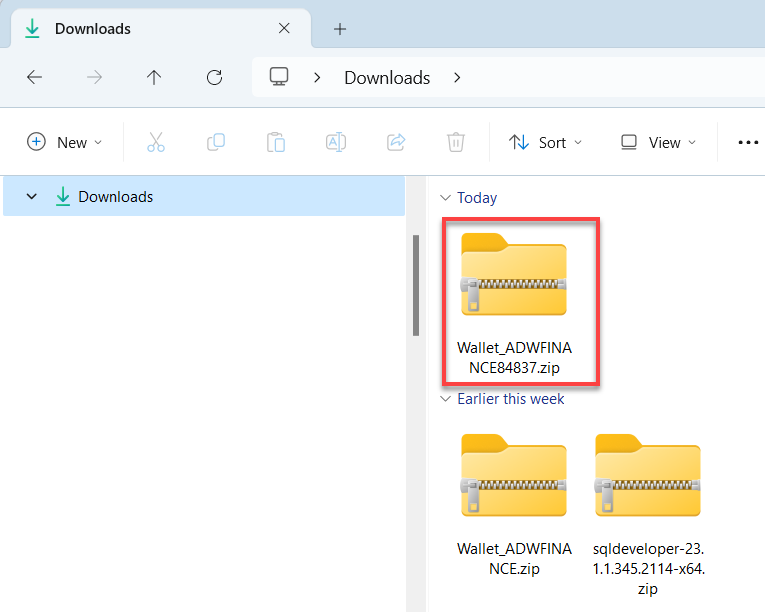
    </if>

## Task 3: Create the SQL Developer Connection

1. In SQL Developer, in the **Connections** panel, click **New Connection** (the green plus icon).

    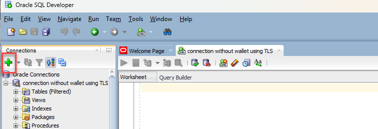

2. In the **New / Select Database Connection** dialog, enter the following values:

    - **Name:** Enter a descriptive connection name, such as `admin_high`.
    - **Username:** Enter `ADMIN`, or another authorized database username.
    - **Password:** Enter the password for the database user.
    - **Connection Type:** Select **Cloud Wallet**.
    - **Configuration File:** Click **Browse**, and then select the downloaded wallet ZIP file.
    - **Service:** Select the service ending in `_high` for this lab, such as `adwfinance_high`.

    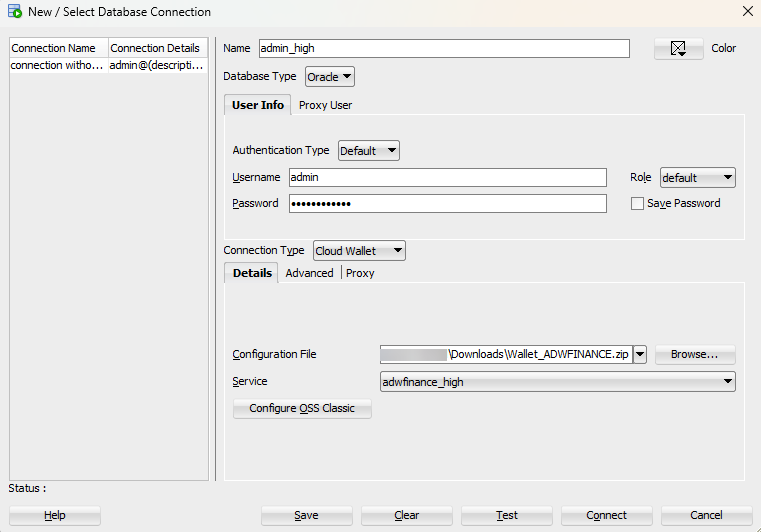

3. Click **Test**. Confirm that **Status: Success** is displayed.

    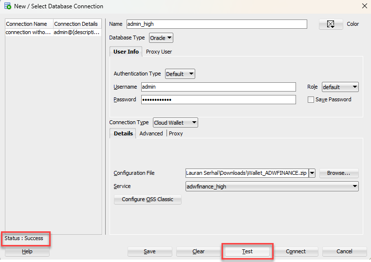

4. Click **Save** to save the connection.

    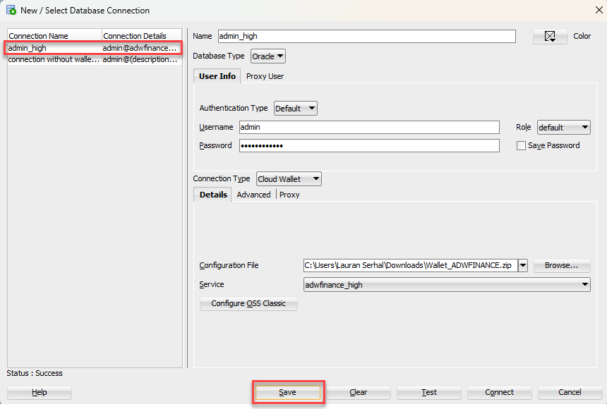

5. Click **Connect**. If prompted, enter the database user password, and then click **OK**. The new connection is displayed in the **Connections** panel.

    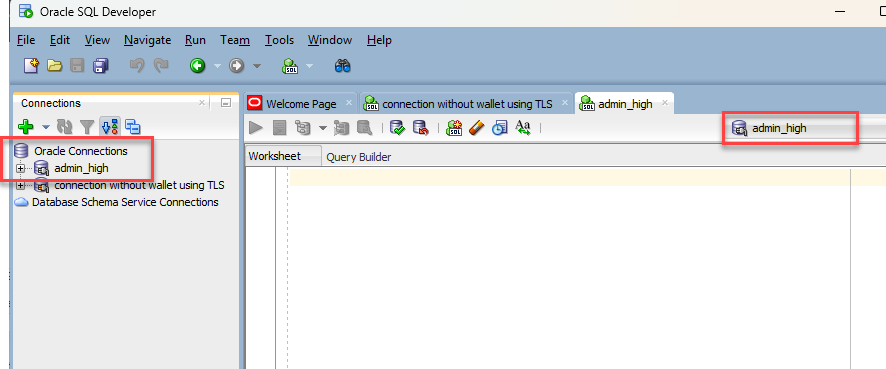

    > **Note:** If the connection test fails behind a corporate VPN or firewall, confirm that the required Oracle Database ports and hosts are allowed. Contact your network administrator if necessary.

You may now **proceed to the next lab**.

## Acknowledgements

- **Authors** - Shilpa Sharma, Principal User Assistance Developer
- **Contributors** - Nigel Bayliss, Product Management Architect
- **Last Updated By/Date** - Shilpa Sharma, September 2026
