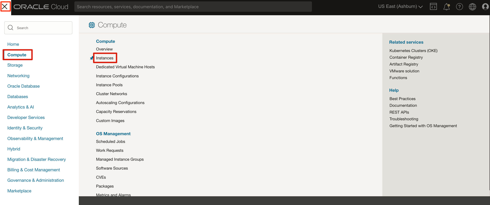

# Create Compute Nodes

## Introduction

An Oracle Cloud Infrastructure (OCI) Compute node is a virtual machine or bare metal server that provides scalable computing capacity for running applications and workloads in the cloud. It offers flexible CPU, memory, and storage configurations, enabling users to deploy, manage, and scale resources efficiently based on business needs.

Estimated Time: 10 minutes

### Objectives

- Navigate to Compute instances in the OCI Console.
- Create an OCI Compute instance.
- Review the instance creation progress.

### Prerequisites

- Access to an Oracle Cloud Infrastructure tenancy.
- Permission to create Compute instances in the selected compartment.

## Task 1: Create a Compute Node

1. Open the **Navigation** menu.

    

2. Click **Compute**. Under **Compute**, click **Instances**.

    

    For faster navigation, you can pin items that you use frequently. To pin an item, hover over the menu item, and then click the pin icon to the left of the item.

3. On the **Instances** page, click **Create instance**.

4. On the **Create compute instance** page, under **Basic information**, provide the following information:

    - **Name:** Enter the Compute instance name.
    - **Create in compartment:** Select a compartment from the drop-down list.
    - **Placement:** Select the availability domain (**AD 1**).

    Leave all other options at their default values.

5. Click **Next**.

6. Review the provided values under **Review**, and then click **Create**.

7. In the **No SSH access** dialog, click **Yes, create instance anyway**.

    > **Note:** Creating an instance without an SSH key means that you cannot connect to it using SSH. Use this option only when SSH access is not required or another access method is configured.

8. You can review the provisioning progress on the **Work requests** page.

You may now **proceed to the next lab**.
