# Generate ASH Reports

## Introduction

Active Session History (ASH) samples active database sessions at regular intervals. An ASH report helps you investigate transient performance problems by showing where sessions spent time, which SQL statements were active, and which wait classes or services contributed to the workload.

Estimated Time: 25 minutes

### Objectives

In this lab, you will:

- Create a moderate test workload that produces ASH samples.
- Use Performance Hub to explore ASH Analytics by SQL ID, wait class, and user.
- Generate an HTML ASH report for the workload SQL statement.
- Remove the demonstration objects after completing the lab.

### Prerequisites

- An available Oracle Autonomous AI Database instance.
- Access to SQL Developer, SQLcl, or SQL*Plus.
- Permission to query `V$SQL` and run `DBMS_WORKLOAD_REPOSITORY.ASH_REPORT_HTML`.
- Permission to open Performance Hub for the Autonomous AI Database instance.

## Task 1: Create an ASH Workload

1. Download and run [Create the ASH workload](files/create-ash-workload.sql) in a non-production schema. The script creates sample customer and order data and gathers optimizer statistics.

    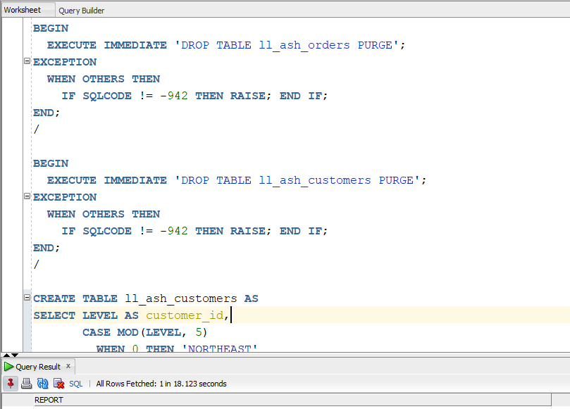

2. Run the workload query included in the script. The row multiplier helps the query run long enough to produce several ASH samples, while the `LL_ASH_TARGET` comment makes the statement easy to identify later.

    ```sql
    <copy>
    SELECT /* LL_ASH_TARGET */
           c.region,
           o.order_status,
           COUNT(*) AS order_count,
           ROUND(SUM(o.order_total), 2) AS total_revenue
    FROM   ll_ash_orders o
    JOIN   ll_ash_customers c
           ON c.customer_id = o.customer_id
    JOIN   (SELECT LEVEL AS n FROM dual CONNECT BY LEVEL <= 100) multiplier
           ON multiplier.n >= 1
    WHERE  o.order_date >= TRUNC(SYSDATE) - 180
    GROUP  BY c.region, o.order_status
    ORDER  BY c.region, o.order_status;
    </copy>
    ```

    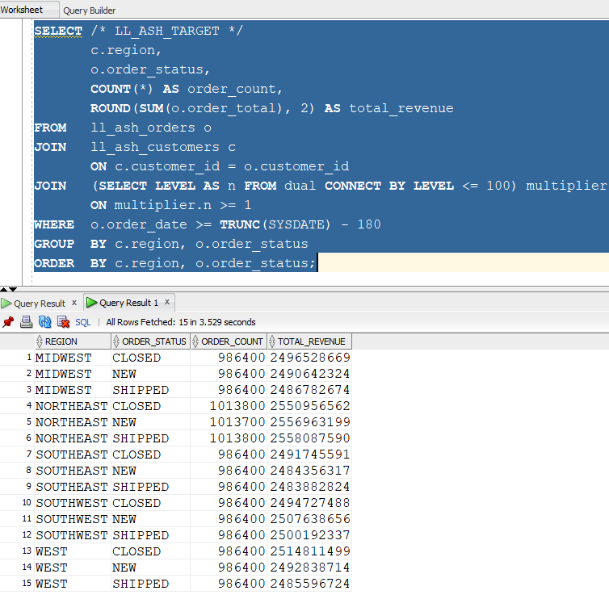

    > **Note:** If the query finishes too quickly, run it again and increase the multiplier from 100 to 200.

3. Download and run [Find the workload SQL ID](files/find-ash-sql-id.sql) immediately after the workload query. Record the returned SQL ID for use later in the lab.

    ```sql
    <copy>
    SELECT sql_id,
           child_number,
           elapsed_time,
           executions,
           last_active_time,
           sql_text
    FROM   v$sql
    WHERE  sql_text LIKE '%LL_ASH_TARGET%'
    AND    sql_text NOT LIKE '%v$sql%'
    ORDER  BY last_active_time DESC
    FETCH FIRST 1 ROW ONLY;
    </copy>
    ```

    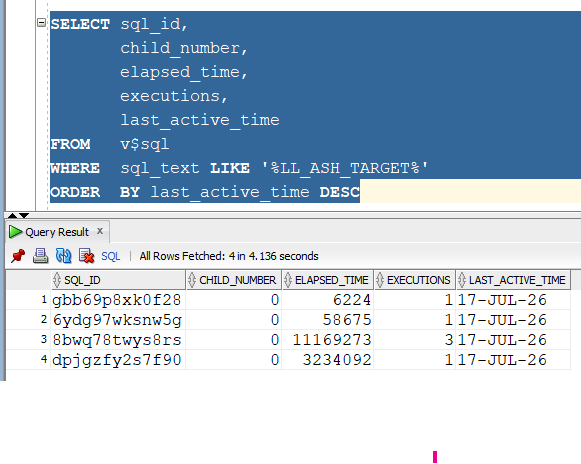

## Task 2: Explore ASH Analytics

1. In the OCI Console, open the details page for your Autonomous AI Database, and then click **Performance Hub**.

    

2. Performance Hub opens with **ASH Analytics** displayed by default and shows ASH data for the last hour.

    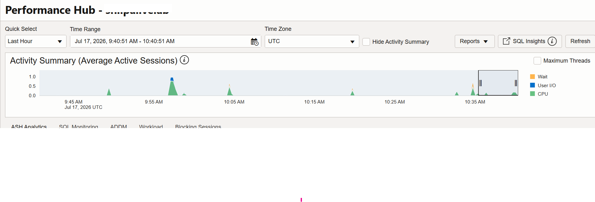

3. Use **Quick Select** to choose a predefined period. If necessary, select **Custom**.

    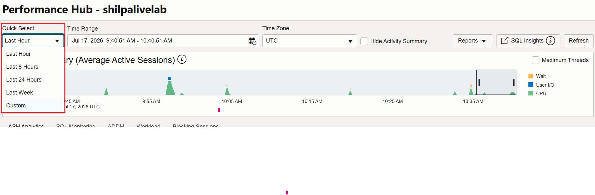

4. For a custom interval, enter a start and end time that includes the workload execution, and then click **Apply**.

    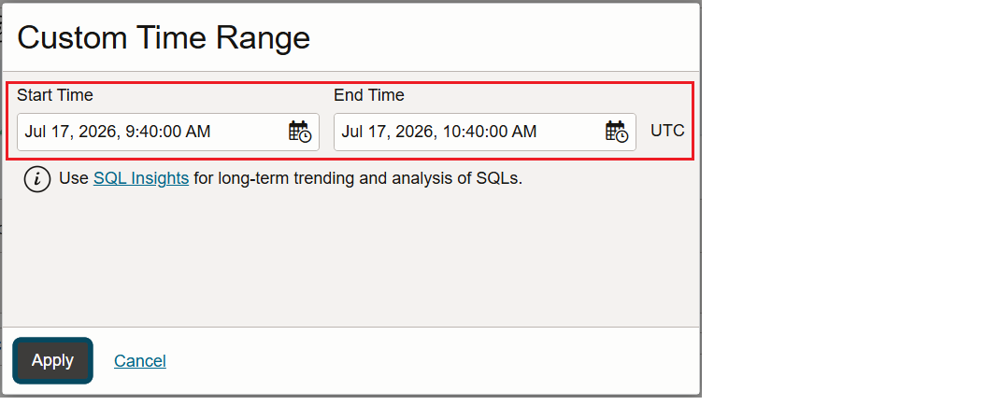

5. Scroll to **ASH Analytics** and confirm that the workload appears as a spike in the Activity Summary. Review average active sessions, CPU and wait activity, top SQL IDs, wait classes, users, services, modules, and sessions.

    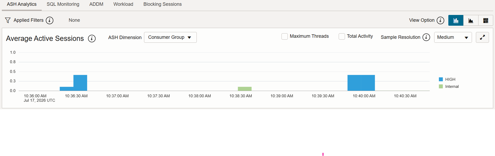

6. Review the **SQL ID** and **User Session** views. Apply filters or select another dimension, such as Wait Class, Consumer Group, User Name, Service, or Module, to analyze the activity from another perspective.

    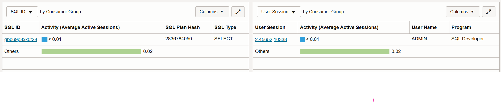

7. Click the workload SQL ID hyperlink. On the SQL details page, use the following tabs:

    - **Summary** shows SQL text, source information, execution plans, and performance metrics.
    - **ASH Analytics** shows sampled session activity for the SQL statement.
    - **Execution Statistics** shows plan and execution details.
    - **SQL Monitoring** shows monitored executions when available.
    - **SQL Text** shows the complete statement.

    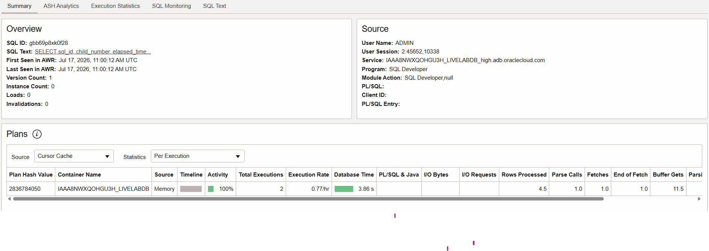

    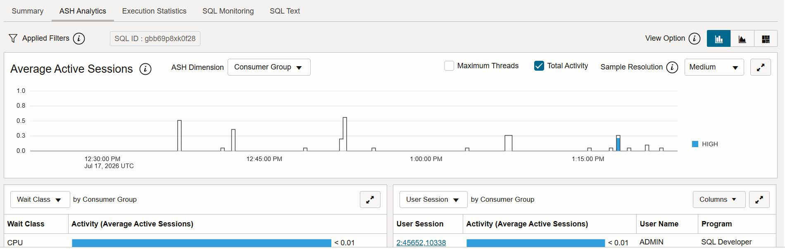

    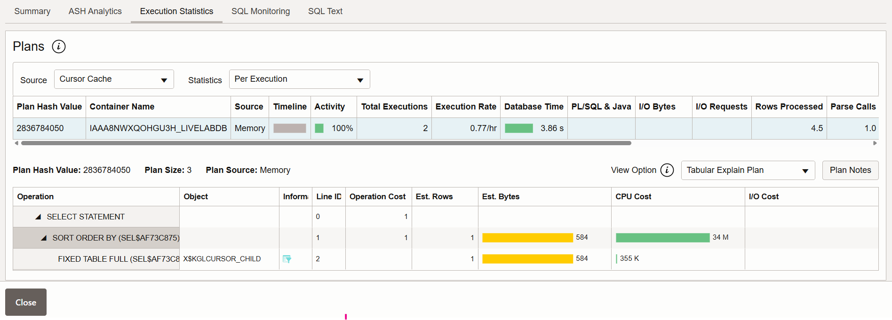

8. Return to ASH Analytics, select the **Wait Class** dimension, and review the session activity.

9. Click a **User Session** hyperlink to inspect its server, client, service, SQL ID, wait class, and activity details.

    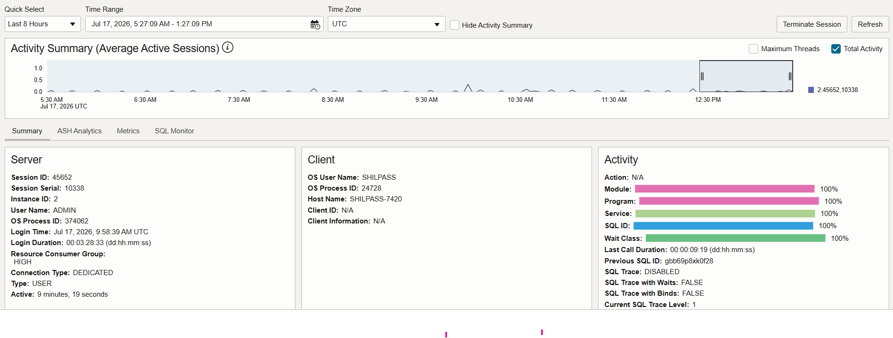

    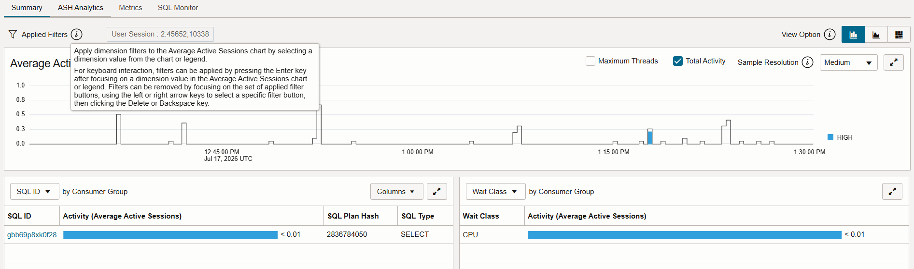

10. Review the session **Metrics** and **SQL Monitor** tabs when those data are available.

    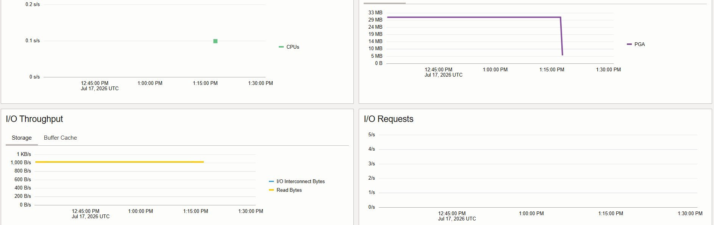

    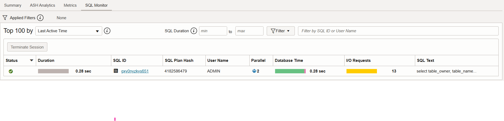

    > **Note:** If the workload SQL ID is not visible, widen the time range and rerun the workload.

## Task 3: Generate an HTML ASH Report

1. Download [Generate the HTML ASH report](files/generate-ash-report.sql).

2. Open the script and replace `REPLACE_WITH_SQL_ID` with the SQL ID recorded in Task 1.

3. Run the script from SQL*Plus or SQLcl. The `SPOOL` command writes the report to `ash_report.html` in the current directory.

    ```sql
    <copy>
    SELECT output
    FROM TABLE(DBMS_WORKLOAD_REPOSITORY.ASH_REPORT_HTML(
      l_dbid     => :l_dbid,
      l_inst_num => :l_inst_num,
      l_btime    => SYSDATE - (15 / 1440),
      l_etime    => SYSDATE,
      l_sql_id   => 'REPLACE_WITH_SQL_ID'));
    </copy>
    ```

4. Open `ash_report.html` in a browser and confirm that it covers the workload interval and SQL ID.

## Task 4: Prepare the Report

A useful ASH report enables another engineer to understand the execution without rerunning the workload. Review the report for the following information:

| Report area | What to look for |
| --- | --- |
| Activity over time | Periods with a high average number of active sessions and changes during the workload interval. |
| Wait classes | Whether sessions spent time on CPU, User I/O, concurrency, or another wait class. |
| SQL identifiers | SQL statements contributing the most active sessions, including `LL_ASH_TARGET`. |
| Sessions and users | Users, services, modules, or sessions associated with the activity. |

## Task 5: Clean Up

When you finish the lab, download and run [Clean up the ASH workload](files/cleanup-ash-workload.sql).

```sql
<copy>
DROP TABLE ll_ash_orders PURGE;
DROP TABLE ll_ash_customers PURGE;
</copy>
```

You may now **proceed to the next lab**.
