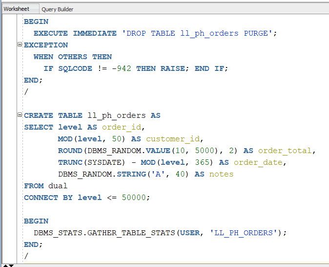
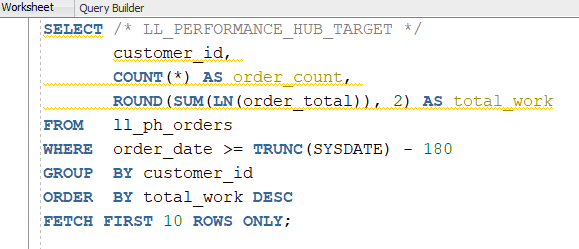
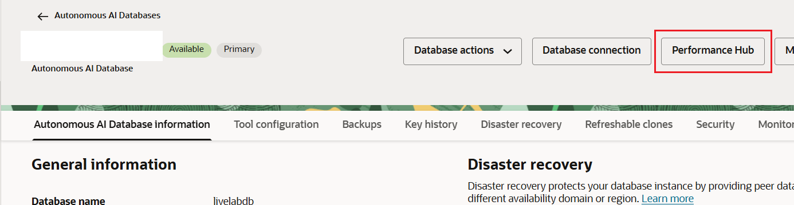
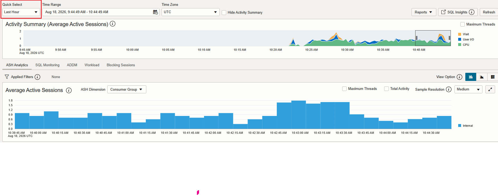
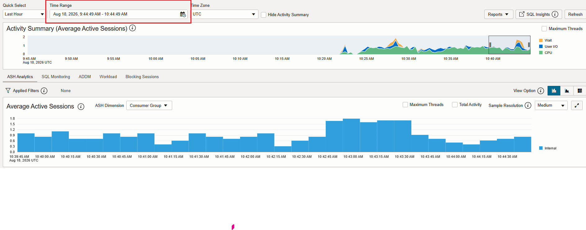
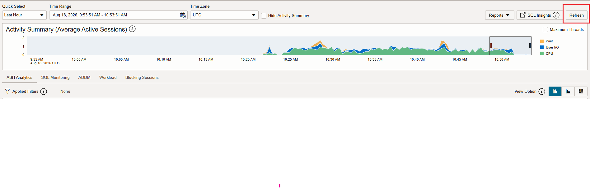
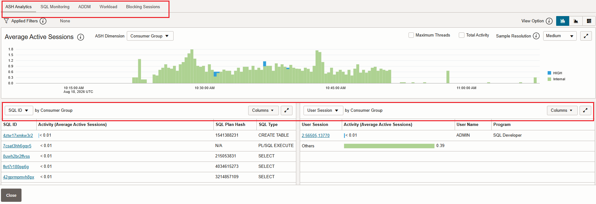

# Generate a Performance Hub Report

## Introduction

Performance Hub helps you monitor Oracle Autonomous AI Database activity for a selected time range. In this lab, you create a small workload, open Performance Hub from the OCI Console, and review key performance statistics that can be shared with Oracle Support.

Estimated Time: 15 minutes

### Objectives

In this lab, you will:

- Create a simple workload that appears in Performance Hub.
- Open Performance Hub from the Autonomous AI Database details page.
- Review real-time and historical performance data for a selected time range.
- Identify workload activity by reviewing SQL activity, wait classes, and database load.
- Collect Performance Hub information for an Oracle Support request.

### Prerequisites

- You have completed the previous labs to provision an Oracle Autonomous AI Database.
- You can sign in to the OCI Console and open the Autonomous AI Database details page.
- You have access to Database Actions or SQL Worksheet to run the sample workload.
- You have permission to open Performance Hub for the Autonomous AI Database instance.

## Task 1: Create a Performance Hub Workload

1. Open a SQL Worksheet for a non-production schema.

2. Download and open the [Performance Hub workload SQL script](files/performance-hub-workload.sql). Run the first section to recreate the `LL_PH_ORDERS` table and gather optimizer statistics.

    ```sql
    <copy>
    BEGIN
      EXECUTE IMMEDIATE 'DROP TABLE ll_ph_orders PURGE';
    EXCEPTION
      WHEN OTHERS THEN
        IF SQLCODE != -942 THEN RAISE; END IF;
    END;
    /

    CREATE TABLE ll_ph_orders AS
    SELECT level AS order_id,
           MOD(level, 50) AS customer_id,
           ROUND(DBMS_RANDOM.VALUE(10, 5000), 2) AS order_total,
           TRUNC(SYSDATE) - MOD(level, 365) AS order_date,
           DBMS_RANDOM.STRING('A', 40) AS notes
    FROM dual
    CONNECT BY level <= 50000;

    BEGIN
      DBMS_STATS.GATHER_TABLE_STATS(USER, 'LL_PH_ORDERS');
    END;
    /
    </copy>
    ```

    

3. Run the workload query. The comment tag helps you identify the statement later in Performance Hub.

    ```sql
    <copy>
    SELECT /* LL_PERFORMANCE_HUB_TARGET */
           customer_id,
           COUNT(*) AS order_count,
           ROUND(SUM(LN(order_total)), 2) AS total_work
    FROM   ll_ph_orders
    WHERE  order_date >= TRUNC(SYSDATE) - 180
    GROUP  BY customer_id
    ORDER  BY total_work DESC
    FETCH FIRST 10 ROWS ONLY;
    </copy>
    ```

    

    > **Note:** If the query finishes too quickly, run it two or three times. Ensure that the selected Performance Hub time range includes this workload activity.

## Task 2: Launch Performance Hub

1. After the workload query completes, return to the OCI Console and open the details page for your Autonomous AI Database.

2. Click **Performance Hub**.

    

3. Performance Hub opens with **ASH Analytics** displayed by default. The **Activity Summary** chart shows database activity during the selected interval, including CPU, User I/O, and wait activity.

    

4. Use **Quick Select** to choose a recent interval such as **Last Hour**.

    

5. If the workload ran earlier, click **Time Range**, and then select a custom start and end time that includes the workload activity.

    

6. After you select the time range, the charts refresh automatically. Click **Refresh** if you need to update the charts manually.

    

7. Review the tabs below the Activity Summary:

    - **ASH Analytics** shows active session activity by dimensions such as SQL ID, wait class, user, or consumer group.
    - **SQL Monitoring** shows monitored SQL executions.
    - **ADDM** displays diagnostic findings and recommendations when available.
    - **Workload** shows workload-related activity.
    - **Blocking Sessions** helps identify sessions that might be blocking other database activity.

8. In **ASH Analytics**, change the **ASH Dimension** to analyze the workload by Consumer Group, SQL ID, Wait Class, or User. Use the lower drill-down section to identify the SQL statements, sessions, users, or programs that contributed most to the selected workload.

    

    > **Note:** Confirm that the selected time range includes the workload peak before recording report details.

## Task 3: Review Performance Statistics

Review the Performance Hub charts and tabs for the selected time range. Record the following information for further analysis or an Oracle Support request:

| Report area | What to look for |
| --- | --- |
| Database Load | Identify workload peaks and compare database activity across the selected time range. |
| Average Active Sessions | Review how many sessions were active and whether activity increased during the workload. |
| Wait Classes | Check whether time was spent on CPU, User I/O, concurrency, application waits, or other wait classes. |
| Top SQL | Look for `LL_PERFORMANCE_HUB_TARGET` or any SQL consuming significant database time. |
| SQL Details | Review SQL ID, execution activity, elapsed time, and related plan or session information when available. |

Confirm that the workload period appears in the charts and note any top SQL statements, wait classes, or database load spikes.

You may now **proceed to the next lab**.
