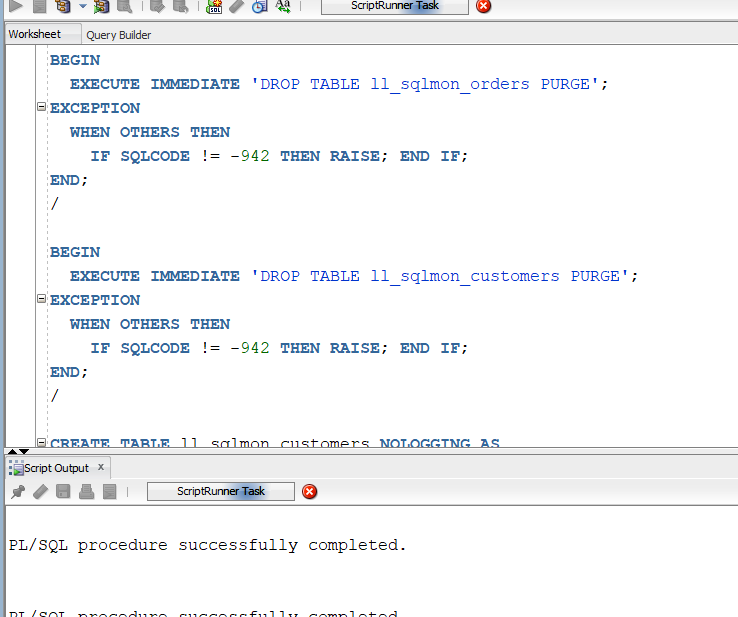
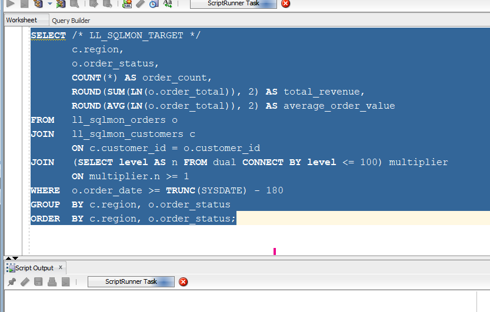
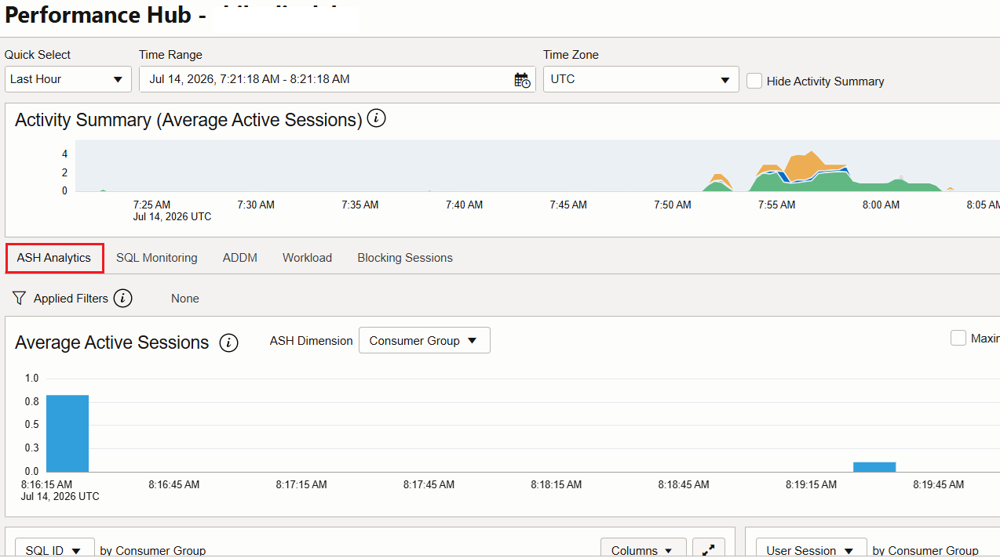
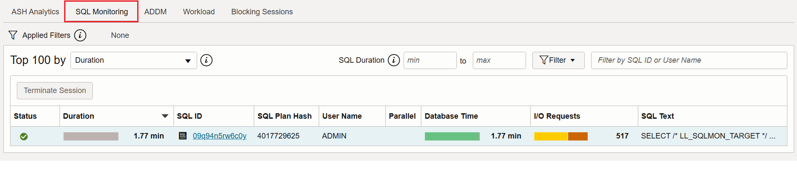
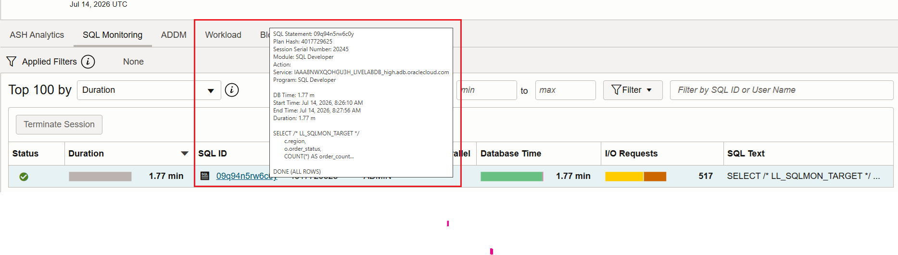
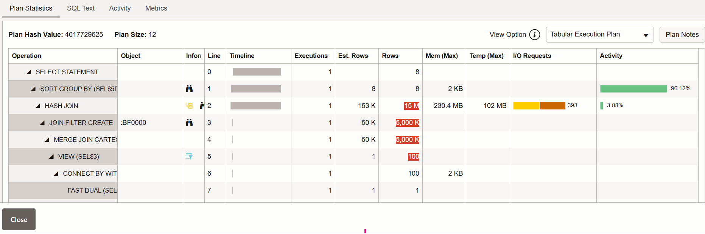

# Generate SQL Monitor Reports

## Introduction

SQL Monitor provides execution-level details for long-running and parallel SQL statements. It shows the execution timeline, waits, row-source progress, estimated and actual row counts, I/O activity, and execution-plan hot spots. In this lab, you create a monitored workload, examine its execution in Performance Hub, and save an active HTML report for later analysis or an Oracle Support request.

Estimated Time: 20 minutes

### Objectives

In this lab, you will:

- Create a demonstration workload that appears in SQL Monitoring.
- Locate a monitored SQL execution in Performance Hub.
- Review plan statistics and execution activity.
- Save an active SQL Monitor report from the user interface.
- Generate the report from SQL Developer as an alternative.
- Remove the demonstration objects after completing the lab.

### Prerequisites

- An available Oracle Autonomous AI Database instance.
- Access to SQL Developer and a non-production schema.
- Permission to open Performance Hub for the Autonomous AI Database instance.
- Permission to run `DBMS_SQLTUNE.REPORT_SQL_MONITOR` if you use the SQL Developer alternative.

## Task 1: Create a Monitored SQL Workload

1. Download [Create the SQL Monitor workload](files/create-sql-monitor-workload.sql), and then open the script in a SQL Developer worksheet connected to a non-production schema.

2. Click **Run Script** or press **F5**. The script recreates two demonstration tables, loads a moderate volume of data, and gathers optimizer statistics. It can take 2-3 minutes to complete.

    

3. Download and open [Run the monitored query](files/run-sql-monitor-query.sql).

4. Click **Run Script** or press **F5**. The `LL_SQLMON_TARGET` comment makes the statement easy to identify in Performance Hub.

    ```sql
    <copy>
    SELECT /* LL_SQLMON_TARGET */
           c.region,
           o.order_status,
           COUNT(*) AS order_count,
           ROUND(SUM(LN(o.order_total)), 2) AS total_revenue,
           ROUND(AVG(LN(o.order_total)), 2) AS average_order_value
    FROM   ll_sqlmon_orders o
    JOIN   ll_sqlmon_customers c
           ON c.customer_id = o.customer_id
    JOIN   (SELECT LEVEL AS n FROM dual CONNECT BY LEVEL <= 100) multiplier
           ON multiplier.n >= 1
    WHERE  o.order_date >= TRUNC(SYSDATE) - 180
    GROUP  BY c.region, o.order_status
    ORDER  BY c.region, o.order_status;
    </copy>
    ```

    

    > **Note:** If the query finishes too quickly, run it again. You can also increase the row multiplier from 100 to 200.

## Task 2: Review the SQL Monitor Report

1. While the target query is running, return to the OCI Console and open the details page for your Autonomous AI Database.

2. Click **Performance Hub**.

    

3. Performance Hub opens with **ASH Analytics** selected by default.

    

4. Click **SQL Monitoring**. From **Top 100 by**, select **Duration** to list the longest-running recently monitored SQL statements first.

    

5. Locate the statement containing `LL_SQLMON_TARGET`. Confirm its SQL ID, duration, status, database time, and I/O requests, and then click its SQL ID.

    

6. On **Plan Statistics**, compare estimated and actual row counts. Review I/O requests and identify the plan lines with the most activity.

    

## Task 3: Save the SQL Monitor Report

1. With the SQL Monitor report open, click the **Download Report** icon in the upper-right corner of the report.

2. Select **Active Report (HTML)**, and then save the downloaded file to your evidence bundle.

3. Use a descriptive filename that includes the SQL ID and capture date, for example `sql-monitor-09q94n5rw6c0y-2026-07-14.html`.

4. Open the saved HTML file and confirm that it loads and includes the execution details before sharing it with Oracle Support.

## Task 4: Generate the Report from SQL Developer

If you cannot download the report from Performance Hub, generate the active HTML report from SQL Developer.

1. Download [Generate the SQL Monitor report](files/generate-sql-monitor-report.sql), and then open it in SQL Developer.

2. Replace `REPLACE_WITH_SQL_ID` with the SQL ID recorded in Task 2.

3. Click **Run Script** or press **F5**. The script writes `sql-monitor-report.html` to the SQL Developer working directory.

    ```sql
    <copy>
    SELECT DBMS_SQLTUNE.REPORT_SQL_MONITOR(
             sql_id       => 'REPLACE_WITH_SQL_ID',
             type         => 'ACTIVE',
             report_level => 'ALL') AS report
    FROM   dual;
    </copy>
    ```

4. Open `sql-monitor-report.html` and confirm that it contains the expected SQL ID and execution details.

## Task 5: Clean Up

When you finish the lab, download and run [Clean up the SQL Monitor workload](files/cleanup-sql-monitor-workload.sql).

```sql
<copy>
DROP TABLE ll_sqlmon_orders PURGE;
DROP TABLE ll_sqlmon_customers PURGE;
</copy>
```

You may now **proceed to the next lab**.

## Acknowledgements

- **Authors** - Shilpa Sharma, Principal User Assistance Developer
- **Contributors** - Nigel Bayliss, Product Management Architect
- **Last Updated By/Date** - Shilpa Sharma, September 2026
